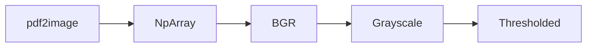

# Splitting PDF files based on the content

## Problem setup

On daily basis operations staff receives numerous documents in *PDF* format. At least 50% of the information is comprised of scans, which may have completely different quality. One of the documents I work with is a *Railway bill*, which is a document issued by a Railroad Authority for each wagon or group of wagons accepted for the transportation. This document is quite remarkable in a sense that it is an irregular table with some hand-written remarks, stamps and other features.  


Most import for us is the first page, which contains information about receiver. Here I provide a picture, where the *region of interest* (ROI) is marked by hand.  

  

The main technical goal is not only to find the ROI, but also to define, which receiver is specified in it. For that reason we will be using simple *OCR* procedure with [Tesseract](https://github.com/tesseract-ocr/tesseract).  

The last step is classification, which shall be performed as a smple [*cosine similarity*](https://en.wikipedia.org/wiki/Cosine_similarity) procedure.

---

## Solution

> Present solution was tested on Windows 10 machine with Python 3.11

First of all let's list the packages used:
* Pandas
* Numpy
* OpenCV-Python
* PyPDF2
* pdf2image
* nltk
* pytesseract
> **IMPORTANT:** don't forget to install Tesseract prior to installation of its Python wrapper.

```Python
from pdf2image import convert_from_path
import cv2
import numpy as np
import pytesseract
from nltk.tokenize import RegexpTokenizer
import pandas as pd
from PyPDF2 import PdfFileReader, PdfFileWriter
```

### OCR of the provided document.
---
Most importan part of the script is an OCR part, which is wrapped in a function **```get_text(page)```**. Since page is an image, generated internally by **pdf2image** package, we need to convert it to Numpy array. 

The following sequence of transformations is applied: 


Then vertical and horizontal filtering is applied, which results in generation of boxes. 


The ROI is then selected by the approximate coorinates of the box, where the required information should be provided. Then the ROI is passed to Tesseract, which results in OCR-generateed string. 

### Classification and splitting of the document.
---
After generation of the string we have to clean it from the punctuation and build an array of words. For this purpose the **Regular Expression Tockenizer** is used. It is pretty straighforward:

```Python
tokenizer = RegexpTokenizer(r'\w+')
```

In order to classify the text we are using a "Dictionary" **Excel** file, which is read with pandas. The dictionary itsef should be tokenized as well in order to perform *Cosine Similarity* assessment, which is performed with the following function:

```Python
def cosine_similarity(a, b):
    l1=[]
    l2=[]
    a_set = set(a)
    b_set = set(b)
    r_vector = a_set.union(b_set)
    for w in r_vector:
        if w in a_set: 
            l1.append(1)
        else:
            l1.append(0)
        if w in b_set:
            l2.append(1)
        else:
            l2.append(0)

    if sum(l1) == 0: 
        return 0

    c = np.dot(l1, l2)
    
    cosine = c / float((sum(l1)*sum(l2))**0.5)
    return cosine
```
***a*** is the vector of words, generated from the OCR procedure;  
***b*** is the vector of words, generated from the tockenization of a dictionary value.  

Firstly we create a set of words from both of the strings we compare. Then we build binary (zeros and ones only) vectors for each string, which show if the particular word is present in it (*1*) or not (*0*).
If the tested string (**a**) is completely different from the dictionary entry we return 0 (no match found). Else we calculate the *cosine* between the two vectors. The closer it to **1**, the more similar two strings are. 

As soon as the best match is found, the program starts to build a dictionary, containing numbers of pages for each group defined by the classification procedure. 

Finally we use ***PyPDF2*** to split and save the files.
